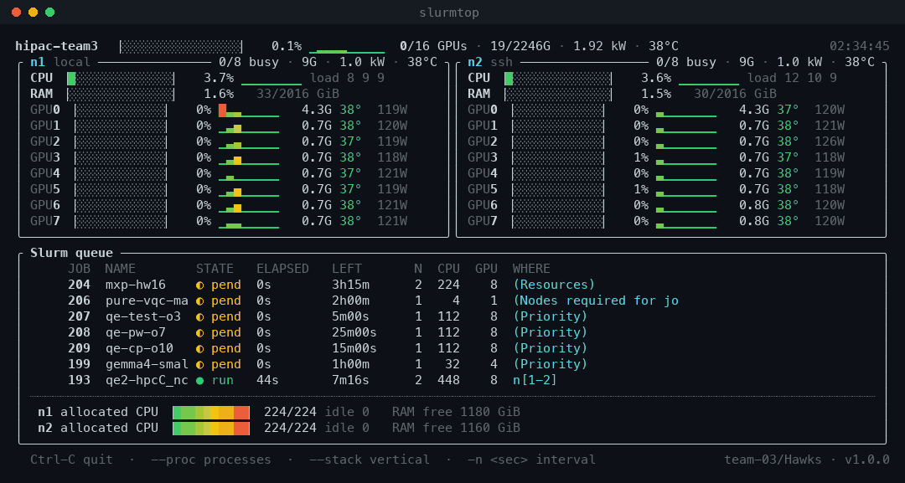
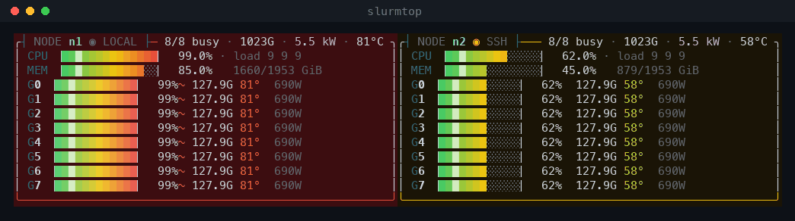

# slurmtop

A one-screen terminal dashboard for small GPU clusters. CPU, RAM, per-GPU
utilisation for every node, plus the Slurm queue — with gradient bars and
sparkline history, in a single 24-line frame.

Built during [HiPAC 2026](https://www.nchc.org.tw/) because `watch nvidia-smi`
on each node in a separate tmux pane got old fast.



*A 2-node / 16×H200 cluster going from idle to pegged and back. The load here
is simulated — same render path, synthetic telemetry — because the cluster was
powered down when this was recorded. Everything you see is what the real thing
draws: the scope filling, both node zones going red, heat plumes at 70 °C,
`FULL LOAD` lighting up, and the progress bars creeping toward each job's
time limit.*

<details>
<summary>Same thing as text</summary>

```
◤ SLURMTOP // hipac-team3 ─────────────────────────────────────────────────────────────────────────────────────────────────────────────── 11:56:32 ◥
  ▁▂▄▅▆▇███▇▆▅▄▂▁    CORE  16/16 online   ◆ FULL LOAD
  99.2% UTIL         PWR    10.49 kW   MEM   1917/2246 GiB   THRM  70°C
  · ████████████     GRID  ▉▉▉▉▉▉▉▉  │  ▉▉▉▉▉▉▉▉
╭┤ LOAD // last 63 samples ├────────────────━──────────────────────────────────────────────────────────────────────────────────────────────────────╮
│ ····································▅▅▅▇▇▇▇▇▇▇▇▇▇▇▇▇▇▇▇▇▇▇▇▇▇▇▇················································································· │
│ ·································▆▆▆███████████████████████████················································································· │
│ ······························▆▆▆██████████████████████████████················································································· │
│ ···························▅▅▅█████████████████████████████████················································································· │
│ ·····················▁▁▁▅▅▅████████████████████████████████████················································································· │
│ ···············▃▃▃▆▆▆██████████████████████████████████████████················································································· │
╰──────────────────────────────────────────────────────────────────────────────────────────────────────────────────────────────────────────────────╯
╭┤ NODE n1 ◉ LOCAL ├──────────────────── 8/8 busy · 958G · 5.2 kW · 70°C ╮╭┤ NODE n2 ◉ SSH ├────────────────────── 8/8 busy · 958G · 5.2 kW · 62°C ╮
│ CPU ▕█░░░░░░░░░░░░░▏   8.0% · ▂▂▂▂▂▂▂▂ load 18 8 7                     ││ CPU ▕█░░░░░░░░░░░░░▏   8.0% · ▂▂▂▂▂▂▂▂ load 18 8 7                     │
│ MEM ▕███████░░░░░░░▏  47.3%   953/2016 GiB                             ││ MEM ▕███████░░░░░░░▏  47.3%   953/2016 GiB                             │
│ G0 ▕████████████▏ 100%~ ████████ 119.8G 68°  660W                      ││ G0 ▕████████████▏ 100%≋ ████████ 119.8G 60°  660W                      │
│ G1 ▕████████████▏  98%≋ ████████ 119.8G 69°  648W                      ││ G1 ▕████████████▏  98%≈ ████████ 119.8G 61°  648W                      │
│ G2 ▕████████████▏ 100%≈ ████████ 119.8G 70°  660W                      ││ G2 ▕████████████▏ 100%~ ████████ 119.8G 62°  660W                      │
│ G3 ▕████████████▏ 100%~ ████████ 119.8G 68°  660W                      ││ G3 ▕████████████▏ 100%≋ ████████ 119.8G 60°  660W                      │
│ G4 ▕████████████▏  98%≋ ████████ 119.8G 69°  648W                      ││ G4 ▕████████████▏  98%≈ ████████ 119.8G 61°  648W                      │
│ G5 ▕████████████▏ 100%≈ ████████ 119.8G 70°  660W                      ││ G5 ▕████████████▏ 100%~ ████████ 119.8G 62°  660W                      │
│ G6 ▕████████████▏ 100%~ ████████ 119.8G 68°  660W                      ││ G6 ▕████████████▏ 100%≋ ████████ 119.8G 60°  660W                      │
│ G7 ▕████████████▏  98%≋ ████████ 119.8G 69°  648W                      ││ G7 ▕████████████▏  98%≈ ████████ 119.8G 61°  648W                      │
╰────────────────────────────────────────────────────────────────────────╯╰────────────────────────────────────────────────────────────────────────╯
╭┤ Slurm queue ├───────────────────────────────━──────────────────────────────────────────────────────────╮  ┤ SCAN ├───────────────────────────────
│      JOB  NAME        STATE   ELAPSED   PROG     LEFT       N  CPU  GPU  WHERE                          │  ⌜─────────────────────────────────────⌝
│      871  hawks-mxp16 ◓ run   12m32s    ██░░░░░░ 47m28s     2  448    8  n[1-2]                         │  │▀▀▀▀▀▀▀▀▀▀▀▀▀▀▀▀▀▀▀▀▀▀▀▀▀▀▀▀▀▀▀▀▀▀▀▀▀│
│      872  hawks-qe-pw ◓ run   9m24s     ███░░░░░ 20m36s     1  224    8  n2                             │  │▀▀▀▀▀▀▀▀▀▀▀▀▀▀▀▀▀▀▀▀▀▀▀▀▀▀▀▀▀▀▀▀▀▀▀▀▀│
│      873  hawks-eagle ◌ pend  0s        ░░░░░░░░ 2h00m      1   32    4  (Resources)                    │  │▀▀▀▀▀▀▀▀▀▀▀▀▀▀▀▀▀▀▀▀▀▀▀▀▀▀▀▀▀▀▀▀▀▀▀▀▀│
│      874  hawks-cfd   ◌ pend  0s        ░░░░░░░░ 3h00m      1   14    -  (Dependency)                   │  │▀▀▀▀▀▀▀▀▀▀▀▀▀▀▀▀▀▀▀▀▀▀▀▀▀▀▀▀▀▀▀▀▀▀▀▀▀│
│ ┈┈┈┈┈┈┈┈┈┈┈┈┈┈┈┈┈┈┈┈┈┈┈┈┈┈┈┈┈┈┈┈┈┈┈┈┈┈┈┈┈┈┈┈┈┈┈┈┈┈┈┈┈┈┈┈┈┈┈┈┈┈┈┈┈┈┈┈┈┈┈┈┈┈┈┈┈┈┈┈┈┈┈┈┈┈┈┈┈┈┈┈┈┈┈┈┈┈┈┈┈┈┈ │  │▀▀▀▀▀▀▀▀▀▀▀▀▀▀▀▀▀▀▀▀▀▀▀▀▀▀▀▀▀▀▀▀▀▀▀▀▀│
│  n1 allocated CPU ▕██████████▏ 224/224 idle 0   RAM free 742 GiB                                        │  │▀▀▀▀▀▀▀▀▀▀▀▀▀▀▀▀▀▀▀▀▀▀▀▀▀▀▀▀▀▀▀▀▀▀▀▀▀│
│  n2 allocated CPU ▕██████████▏ 224/224 idle 0   RAM free 742 GiB                                        │  │▀▀▀▀▀▀▀▀▀▀▀▀▀▀▀▀▀▀▀▀▀▀▀▀▀▀▀▀▀▀▀▀▀▀▀▀▀│
│                                                                                                         │  │▀▀▀▀▀▀▀▀▀▀▀▀▀▀▀▀▀▀▀▀▀▀▀▀▀▀▀▀▀▀▀▀▀▀▀▀▀│
│                                                                                                         │  │▀▀▀▀▀▀▀▀▀▀▀▀▀▀▀▀▀▀▀▀▀▀▀▀▀▀▀▀▀▀▀▀▀▀▀▀▀│
│                                                                                                         │  │▀▀▀▀▀▀▀▀▀▀▀▀▀▀▀▀▀▀▀▀▀▀▀▀▀▀▀▀▀▀▀▀▀▀▀▀▀│
│                                                                                                         │  │▀▀▀▀▀▀▀▀▀▀▀▀▀▀▀▀▀▀▀▀▀▀▀▀▀▀▀▀▀▀▀▀▀▀▀▀▀│
│                                                                                                         │  │▀▀▀▀▀▀▀▀▀▀▀▀▀▀▀▀▀▀▀▀▀▀▀▀▀▀▀▀▀▀▀▀▀▀▀▀▀│
│                                                                                                         │  │▀▀▀▀▀▀▀▀▀▀▀▀▀▀▀▀▀▀▀▀▀▀▀▀▀▀▀▀▀▀▀▀▀▀▀▀▀│
│                                                                                                         │  │▀▀▀▀▀▀▀▀▀▀▀▀▀▀▀▀▀▀▀▀▀▀▀▀▀▀▀▀▀▀▀▀▀▀▀▀▀│
│                                                                                                         │  │▀▀▀▀▀▀▀▀▀▀▀▀▀▀▀▀▀▀▀▀▀▀▀▀▀▀▀▀▀▀▀▀▀▀▀▀▀│
│                                                                                                         │  │▀▀▀▀▀▀▀▀▀▀▀▀▀▀▀▀▀▀▀▀▀▀▀▀▀▀▀▀▀▀▀▀▀▀▀▀▀│
│                                                                                                         │  │▀▀▀▀▀▀▀▀▀▀▀▀▀▀▀▀▀▀▀▀▀▀▀▀▀▀▀▀▀▀▀▀▀▀▀▀▀│
│                                                                                                         │  │▀▀▀▀▀▀▀▀▀▀▀▀▀▀▀▀▀▀▀▀▀▀▀▀▀▀▀▀▀▀▀▀▀▀▀▀▀│
│                                                                                                         │  │▀▀▀▀▀▀▀▀▀▀▀▀▀▀▀▀▀▀▀▀▀▀▀▀▀▀▀▀▀▀▀▀▀▀▀▀▀│
│                                                                                                         │  ⌞─────────────────────────────────────⌟
╰─────────────────────────────────────────────────────────────────────────────────────────────────────────╯      github.com/Sean-Hawks/slurmtop
  Ctrl-C quit  ·  --proc processes  ·  --stack vertical  ·  -n <sec> interval                                                 team-03/Hawks · v1.0.0
```

</details>



*The whole panel is tinted by node load: n1 pegged and hot, n2 middling, idle
nodes stay dark.*

## Why

`nvtop` is great but shows one machine. `squeue` tells you what is queued but
not whether the GPUs are actually doing anything. On a handful of nodes you
usually want both at once, on one screen, without installing an agent, a time
series database and a web UI.

## Install

Single file, no dependencies beyond the standard library.

```bash
curl -fsSL https://raw.githubusercontent.com/Sean-Hawks/slurmtop/main/install.sh | bash
```

The installer picks `/usr/local/bin` when it can write there (using `sudo` if
passwordless sudo is available) and falls back to `~/.local/bin`, telling you
how to fix your `PATH` if needed. Pass a directory to choose yourself:

```bash
curl -fsSL .../install.sh | bash -s -- ~/bin
```

Or just drop the single file in place — that is all the installer does:

```bash
curl -fsSLo /usr/local/bin/slurmtop \
  https://raw.githubusercontent.com/Sean-Hawks/slurmtop/main/slurmtop
chmod +x /usr/local/bin/slurmtop
```

Only the machine you run it from needs the script — it reads the other nodes
over SSH. Installing it on every node is optional but handy.

Requirements:

- Python 3.8+ on the machine you run it from
- `nvidia-smi` on each node
- passwordless SSH from that machine to every remote node
- Slurm (optional — used for node discovery and the queue panel; without it
  pass `--nodes` and the queue section is simply empty)

## Usage

```bash
slurmtop                    # refresh every 2s, nodes discovered from Slurm
slurmtop -n 5               # refresh every 5s
slurmtop --once             # print one frame and exit (good for chat/logs)
slurmtop --nodes a,b,c      # explicit node list, skip Slurm discovery
slurmtop --proc             # also list the processes on each GPU
slurmtop --stack            # force vertical layout
slurmtop --fit              # squeeze into one screen instead of showing everything
slurmtop --no-color         # plain text
slurmtop --no-splash        # skip the boot animation
slurmtop --qr               # print only the QR code and exit
slurmtop --no-qr            # hide the QR panel in the dashboard (on by default)
slurmtop --qr-wide          # double-width QR modules, for fonts with gappy blocks
slurmtop --ascii            # ASCII bars, for fonts without block glyphs
slurmtop --lang zh          # 繁體中文介面（預設依 $LANG 自動判斷）
slurmtop --title "lab-gpu"  # header title (default: Slurm ClusterName)
```

Run it on any node in the cluster. The node you are on is read locally; the
rest are read over SSH, one round trip each per refresh.

## Reading the display

| Element | Meaning |
|---|---|
| `▕███░░░▏` | gradient bar, green → yellow → red |
| `▁▂▃▅▇` | sparkline of the last 24 refreshes — tells idle-but-spiky apart from steadily pegged |
| `▲` `▼` | trend against the last few samples |
| arc gauge | cluster GPU utilisation — the dome fills left to right and is tinted by the value, so both shape and colour carry the reading |
| `◤ ◥` `┤ ├` | HUD chrome — section labels and frame ticks |
| `◉` | per-node status LED, tinted by that node's load |
| tinted panel background | the whole node zone warms up with its load — amber past 45 %, orange past 75 %, pulsing red past 90 % — so the node that is cooking is obvious without reading a single number |
| moving bright cell in a bar | scan sweep, advances every refresh |
| `≋ ≈ ~` next to a GPU | heat plume — the GPU is ≥70 °C or ≥95 % utilised |
| breathing bars | anything pegged at ≥95 % pulses; so does a job within 15 % of its time limit |
| `◆ FULL LOAD` | cluster mean utilisation ≥90 %, blinking |
| `▲ THERMAL` | hottest GPU ≥78 °C, blinking |
| LOAD panel | cluster utilisation on a sweeping scope — data is written in a circle like an EKG, the bright column is the write head, and each cell uses eighth-blocks so six rows resolve 48 levels |
| bright cell running along a border | signal trace, one per panel at different phases |
| `GPUs ▉▉▁▁▁▁▁▁ │ ▉▉▉▉▉▉▉▉` | one cell per GPU in the cluster, grouped by node — the whole fleet at a glance |
| `◓ run` / `◌ pend` | Slurm job state; the running marker spins on every refresh |
| `PROG ███░░░░░` | how much of the job's time limit is used up — turns red as it approaches the wall |
| `2h45m`, `20m00s`, `3d02h` | durations, always with units |
| header line | cluster totals: mean GPU utilisation, busy GPU count, VRAM, power draw, hottest GPU |
| panel border | tinted by that node's average GPU load |

By default nothing is hidden: every GPU row and every queued job is printed,
even if the result is taller than the window. If the queue is long, the job
list splits into two or three columns to claw back some height, but jobs are
never dropped.

The layout fills the terminal: node panels split the full width evenly rather
than sitting at a fixed size with dead space to the right, the queue takes
whatever is left beside the QR panel, and spare vertical space goes to the
LOAD scope. Sparklines need panels at least 58 columns wide.

If you would rather have a single screen that never scrolls, use `--fit`. That
mode gives up detail in order — sparklines, then per-GPU rows collapsed to one
line per node, then multi-column jobs, and finally trimming the job list with
a `N more job(s) hidden` note.

If bars and sparklines show up as blank boxes or oddly wide blocks, your font
lacks the Unicode block glyphs. Use `--ascii`:

```
hipac-team3  [#...............]   6.2% ..........  1/16 GPUs · 129/2246G · 2.16 kW · 49°C
│ CPU [..............]   0.6% load 5 6 7        ││ GPU0 [############]  99% 128.6G 49°  502W  │
```

The live view runs in the terminal's alternate screen buffer, so quitting
restores whatever was on screen before and leaves no stack of stale frames in
your scrollback.

## Notes

- Reads only `nvidia-smi`, `/proc/stat`, `/proc/loadavg`, `free`, `squeue` and
  `sinfo`. Nothing is written anywhere and no daemon is installed.
- Sparkline history lives in the process, so it starts empty on each launch.
- AMD/Intel GPUs are not supported (patches welcome — the only coupling is the
  `nvidia-smi --query-gpu` call in `REMOTE`).

## Scan it

The dashboard carries a `SCAN` panel on the right with a scannable QR code for
this repo — handy for getting the link onto someone's phone at a competition
without reading a URL out loud.

Each module is one character wide and half a character tall — the upper half
of a cell is the foreground, the lower half the background — so modules come
out square on any terminal whose cell is roughly 1:2. Verified by decoding
rendered output at cell ratios from 1.8 to 2.4, standalone and inside a full
dashboard frame. The panel is 44 columns and appears when at least 72 are left
for the queue; `--no-qr` hides it, `--qr` prints just the code.

If your font draws block characters with gaps and a scanner struggles,
`--qr-wide` redraws each module two characters wide using background colour
only, which does not depend on glyph coverage at all.


To print just the code:

```bash
slurmtop --qr
```

The matrix is embedded in the script, so no QR library is needed on the
machine.

## Credits

Built by **team-03 / Hawks** during HiPAC 2026 at NCHC.
Issues and pull requests welcome.

## License

MIT
