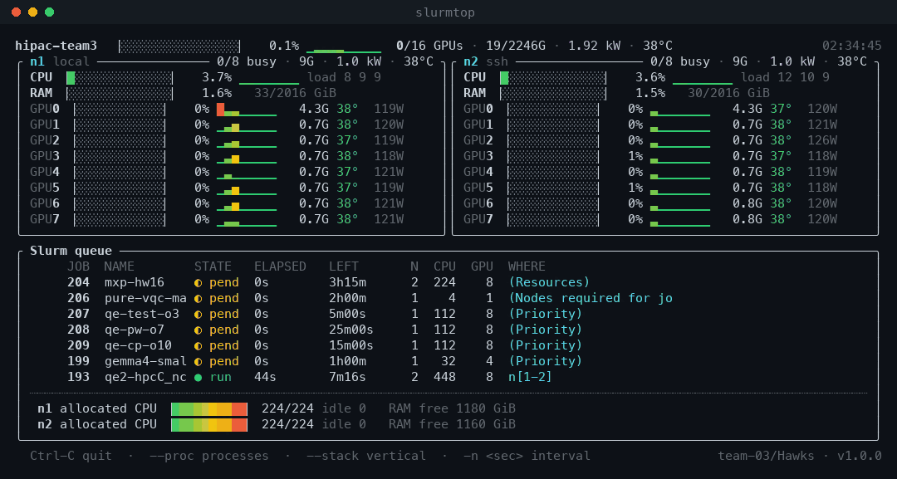
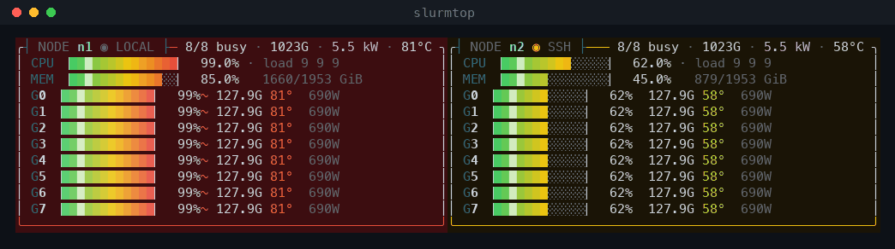

# slurmtop

A one-screen terminal dashboard for small GPU clusters. CPU, RAM, per-GPU
utilisation for every node, plus the Slurm queue — with gradient bars and
sparkline history, in a single 24-line frame.

Built during [HiPAC 2026](https://www.nchc.org.tw/) because `watch nvidia-smi`
on each node in a separate tmux pane got old fast.



*A 2-node / 16×H200 cluster going from idle to pegged and back. The load here
is simulated — same render path, synthetic telemetry — because the cluster was
powered down when this was recorded. Everything you see is what the real thing
draws: the scope filling, both node zones going red, heat plumes at 70 °C,
`FULL LOAD` lighting up, and the progress bars creeping toward each job's
time limit. The recording was made with `--flair --qr-panel`; by default the
dashboard holds still — no plumes, sweeps, blinking or QR panel — see
[Animations](#animations).*

<details>
<summary>Same thing as text (<code>--flair --qr-panel</code>, before the USER column)</summary>

```
◤ SLURMTOP // hipac-team3 ─────────────────────────────────────────────────────────────────────────────────────────────────────────────── 11:56:32 ◥
  ▁▂▄▅▆▇███▇▆▅▄▂▁    CORE  16/16 online   ◆ FULL LOAD
  99.2% UTIL         PWR    10.49 kW   MEM   1917/2246 GiB   THRM  70°C
  · ████████████     GRID  ▉▉▉▉▉▉▉▉  │  ▉▉▉▉▉▉▉▉
╭┤ LOAD // last 63 samples ├────────────────━──────────────────────────────────────────────────────────────────────────────────────────────────────╮
│ ····································▅▅▅▇▇▇▇▇▇▇▇▇▇▇▇▇▇▇▇▇▇▇▇▇▇▇▇················································································· │
│ ·································▆▆▆███████████████████████████················································································· │
│ ······························▆▆▆██████████████████████████████················································································· │
│ ···························▅▅▅█████████████████████████████████················································································· │
│ ·····················▁▁▁▅▅▅████████████████████████████████████················································································· │
│ ···············▃▃▃▆▆▆██████████████████████████████████████████················································································· │
╰──────────────────────────────────────────────────────────────────────────────────────────────────────────────────────────────────────────────────╯
╭┤ NODE n1 ◉ LOCAL ├──────────────────── 8/8 busy · 958G · 5.2 kW · 70°C ╮╭┤ NODE n2 ◉ SSH ├────────────────────── 8/8 busy · 958G · 5.2 kW · 62°C ╮
│ CPU ▕█░░░░░░░░░░░░░▏   8.0% · ▂▂▂▂▂▂▂▂ load 18 8 7                     ││ CPU ▕█░░░░░░░░░░░░░▏   8.0% · ▂▂▂▂▂▂▂▂ load 18 8 7                     │
│ MEM ▕███████░░░░░░░▏  47.3%   953/2016 GiB                             ││ MEM ▕███████░░░░░░░▏  47.3%   953/2016 GiB                             │
│ G0 ▕████████████▏ 100%~ ████████ 119.8G 68°  660W                      ││ G0 ▕████████████▏ 100%≋ ████████ 119.8G 60°  660W                      │
│ G1 ▕████████████▏  98%≋ ████████ 119.8G 69°  648W                      ││ G1 ▕████████████▏  98%≈ ████████ 119.8G 61°  648W                      │
│ G2 ▕████████████▏ 100%≈ ████████ 119.8G 70°  660W                      ││ G2 ▕████████████▏ 100%~ ████████ 119.8G 62°  660W                      │
│ G3 ▕████████████▏ 100%~ ████████ 119.8G 68°  660W                      ││ G3 ▕████████████▏ 100%≋ ████████ 119.8G 60°  660W                      │
│ G4 ▕████████████▏  98%≋ ████████ 119.8G 69°  648W                      ││ G4 ▕████████████▏  98%≈ ████████ 119.8G 61°  648W                      │
│ G5 ▕████████████▏ 100%≈ ████████ 119.8G 70°  660W                      ││ G5 ▕████████████▏ 100%~ ████████ 119.8G 62°  660W                      │
│ G6 ▕████████████▏ 100%~ ████████ 119.8G 68°  660W                      ││ G6 ▕████████████▏ 100%≋ ████████ 119.8G 60°  660W                      │
│ G7 ▕████████████▏  98%≋ ████████ 119.8G 69°  648W                      ││ G7 ▕████████████▏  98%≈ ████████ 119.8G 61°  648W                      │
╰────────────────────────────────────────────────────────────────────────╯╰────────────────────────────────────────────────────────────────────────╯
╭┤ Slurm queue ├───────────────────────────────━──────────────────────────────────────────────────────────╮  ┤ SCAN ├───────────────────────────────
│      JOB  NAME        STATE   ELAPSED   PROG     LEFT       N  CPU  GPU  WHERE                          │  ⌜─────────────────────────────────────⌝
│      871  hawks-mxp16 ◓ run   12m32s    ██░░░░░░ 47m28s     2  448    8  n[1-2]                         │  │▀▀▀▀▀▀▀▀▀▀▀▀▀▀▀▀▀▀▀▀▀▀▀▀▀▀▀▀▀▀▀▀▀▀▀▀▀│
│      872  hawks-qe-pw ◓ run   9m24s     ███░░░░░ 20m36s     1  224    8  n2                             │  │▀▀▀▀▀▀▀▀▀▀▀▀▀▀▀▀▀▀▀▀▀▀▀▀▀▀▀▀▀▀▀▀▀▀▀▀▀│
│      873  hawks-eagle ◌ pend  0s        ░░░░░░░░ 2h00m      1   32    4  (Resources)                    │  │▀▀▀▀▀▀▀▀▀▀▀▀▀▀▀▀▀▀▀▀▀▀▀▀▀▀▀▀▀▀▀▀▀▀▀▀▀│
│      874  hawks-cfd   ◌ pend  0s        ░░░░░░░░ 3h00m      1   14    -  (Dependency)                   │  │▀▀▀▀▀▀▀▀▀▀▀▀▀▀▀▀▀▀▀▀▀▀▀▀▀▀▀▀▀▀▀▀▀▀▀▀▀│
│ ┈┈┈┈┈┈┈┈┈┈┈┈┈┈┈┈┈┈┈┈┈┈┈┈┈┈┈┈┈┈┈┈┈┈┈┈┈┈┈┈┈┈┈┈┈┈┈┈┈┈┈┈┈┈┈┈┈┈┈┈┈┈┈┈┈┈┈┈┈┈┈┈┈┈┈┈┈┈┈┈┈┈┈┈┈┈┈┈┈┈┈┈┈┈┈┈┈┈┈┈┈┈┈ │  │▀▀▀▀▀▀▀▀▀▀▀▀▀▀▀▀▀▀▀▀▀▀▀▀▀▀▀▀▀▀▀▀▀▀▀▀▀│
│  n1 allocated CPU ▕██████████▏ 224/224 idle 0   RAM free 742 GiB                                        │  │▀▀▀▀▀▀▀▀▀▀▀▀▀▀▀▀▀▀▀▀▀▀▀▀▀▀▀▀▀▀▀▀▀▀▀▀▀│
│  n2 allocated CPU ▕██████████▏ 224/224 idle 0   RAM free 742 GiB                                        │  │▀▀▀▀▀▀▀▀▀▀▀▀▀▀▀▀▀▀▀▀▀▀▀▀▀▀▀▀▀▀▀▀▀▀▀▀▀│
│                                                                                                         │  │▀▀▀▀▀▀▀▀▀▀▀▀▀▀▀▀▀▀▀▀▀▀▀▀▀▀▀▀▀▀▀▀▀▀▀▀▀│
│                                                                                                         │  │▀▀▀▀▀▀▀▀▀▀▀▀▀▀▀▀▀▀▀▀▀▀▀▀▀▀▀▀▀▀▀▀▀▀▀▀▀│
│                                                                                                         │  │▀▀▀▀▀▀▀▀▀▀▀▀▀▀▀▀▀▀▀▀▀▀▀▀▀▀▀▀▀▀▀▀▀▀▀▀▀│
│                                                                                                         │  │▀▀▀▀▀▀▀▀▀▀▀▀▀▀▀▀▀▀▀▀▀▀▀▀▀▀▀▀▀▀▀▀▀▀▀▀▀│
│                                                                                                         │  │▀▀▀▀▀▀▀▀▀▀▀▀▀▀▀▀▀▀▀▀▀▀▀▀▀▀▀▀▀▀▀▀▀▀▀▀▀│
│                                                                                                         │  │▀▀▀▀▀▀▀▀▀▀▀▀▀▀▀▀▀▀▀▀▀▀▀▀▀▀▀▀▀▀▀▀▀▀▀▀▀│
│                                                                                                         │  │▀▀▀▀▀▀▀▀▀▀▀▀▀▀▀▀▀▀▀▀▀▀▀▀▀▀▀▀▀▀▀▀▀▀▀▀▀│
│                                                                                                         │  │▀▀▀▀▀▀▀▀▀▀▀▀▀▀▀▀▀▀▀▀▀▀▀▀▀▀▀▀▀▀▀▀▀▀▀▀▀│
│                                                                                                         │  │▀▀▀▀▀▀▀▀▀▀▀▀▀▀▀▀▀▀▀▀▀▀▀▀▀▀▀▀▀▀▀▀▀▀▀▀▀│
│                                                                                                         │  │▀▀▀▀▀▀▀▀▀▀▀▀▀▀▀▀▀▀▀▀▀▀▀▀▀▀▀▀▀▀▀▀▀▀▀▀▀│
│                                                                                                         │  │▀▀▀▀▀▀▀▀▀▀▀▀▀▀▀▀▀▀▀▀▀▀▀▀▀▀▀▀▀▀▀▀▀▀▀▀▀│
│                                                                                                         │  │▀▀▀▀▀▀▀▀▀▀▀▀▀▀▀▀▀▀▀▀▀▀▀▀▀▀▀▀▀▀▀▀▀▀▀▀▀│
│                                                                                                         │  ⌞─────────────────────────────────────⌟
╰─────────────────────────────────────────────────────────────────────────────────────────────────────────╯      github.com/Sean-Hawks/slurmtop
  Ctrl-C quit  ·  --proc processes  ·  --stack vertical  ·  -n <sec> interval                                                 team-03/Hawks · v1.0.0
```

</details>



*The whole panel is tinted by node load: n1 pegged and hot, n2 middling, idle
nodes stay dark.*

**Terminal, browser, Grafana or a report file** — the same single script gives
you a live terminal dashboard, a live dashboard in any browser (`--web`), a
Prometheus endpoint, JSON for scripts, and recorded performance reports with
charts (`--report`), on Linux, macOS, FreeBSD and Windows, with NVIDIA, AMD,
Apple Silicon and Jetson GPUs.

## Why

`nvtop` is great but shows one machine. `squeue` tells you what is queued but
not whether the GPUs are actually doing anything. On a handful of nodes you
usually want both at once, on one screen, without installing an agent, a time
series database and a web UI.

## Install

Single file, no dependencies beyond the standard library.

```bash
curl -fsSL https://raw.githubusercontent.com/Sean-Hawks/slurmtop/main/install.sh | bash
```

The installer picks `/usr/local/bin` when it can write there (using `sudo` if
passwordless sudo is available) and falls back to `~/.local/bin`, telling you
how to fix your `PATH` if needed. Pass a directory to choose yourself:

```bash
curl -fsSL .../install.sh | bash -s -- ~/bin
```

Or just drop the single file in place — that is all the installer does:

```bash
curl -fsSLo /usr/local/bin/slurmtop \
  https://raw.githubusercontent.com/Sean-Hawks/slurmtop/main/slurmtop
chmod +x /usr/local/bin/slurmtop
```

On Windows (PowerShell), or just run `py slurmtop` from wherever you saved it:

```powershell
irm https://raw.githubusercontent.com/Sean-Hawks/slurmtop/main/install.ps1 | iex
```

Only the machine you run it from needs the script — it reads the other nodes
over SSH. Installing it on every node is optional but handy.

Requirements:

- Python 3.8+ on the machine you run it from
- a POSIX `sh` on each remote node (bash is used when present, not required)
- passwordless SSH from that machine to every remote node

Everything else is optional and degrades cleanly:

| Missing | What happens |
|---|---|
| `nvidia-smi` / no GPU | node panels show CPU and RAM only, and the header switches its main gauge to CPU |
| Slurm | pass `--nodes` or `--ssh-config`; the queue panel just says there are no jobs |
| a second machine | `slurmtop --nodes localhost` watches the box you are on, no SSH involved |

### Where it runs

| Machine | CPU / memory / disk / network | GPUs |
|---|---|---|
| Linux | `/proc`, `free`, `df`, `/proc/net/dev` | NVIDIA via `nvidia-smi`; AMD via amdgpu sysfs (no `rocm-smi` needed); NVIDIA Jetson via sysfs |
| macOS | `top`, `vm_stat`, `sysctl`, `df` (data volume), `netstat` | Apple Silicon and Intel-Mac GPUs via `ioreg` (utilisation and memory; temperature/power need `sudo powermetrics`, so they show `-`) |
| FreeBSD | `kern.cp_time`, `vm.stats`, `df`, `netstat` | NVIDIA via `nvidia-smi` if installed |
| Windows (the machine you run it on) | Win32 API through `ctypes`, `netstat -e` | NVIDIA via `nvidia-smi.exe` |
| Windows → remote Linux nodes | over the built-in OpenSSH client | as for Linux |

Nodes are read with a small POSIX shell script, so any login shell works
(bash, dash, zsh, csh, fish), and nothing is installed on them. Intel GPUs are
not read yet (their Linux drivers do not expose utilisation without root).

If the terminal cannot show Unicode block characters (a Windows console
redirected to a file, `LANG=C` on an old system) the whole screen falls back
to plain ASCII instead of failing; `--ascii` forces the ASCII bars.

## Usage

```bash
slurmtop                    # refresh every 2s, nodes discovered from Slurm
slurmtop -n 5               # refresh every 5s
slurmtop --once             # print one frame and exit (good for chat/logs)
slurmtop --nodes a,b,c      # explicit node list, skip Slurm discovery
slurmtop --nodes localhost  # single machine, no SSH, no Slurm needed
slurmtop --ssh-config       # every Host in ~/.ssh/config (wildcards skipped)
slurmtop --proc             # also list the processes on each GPU
slurmtop --me               # only your own jobs and the GPUs they hold
slurmtop --idle-samples 15  # flag held-but-idle GPUs after 15 samples (default 30)
slurmtop --stack            # force vertical layout
slurmtop --dense            # one line per node (automatic when panels would not fit)
slurmtop --fit              # squeeze into one screen instead of showing everything
slurmtop --no-color         # plain text
slurmtop --flair            # turn on every animation, plus the boot splash
slurmtop --no-splash        # with --flair, skip just the boot animation
slurmtop --node-timeout 3   # wait at most 3s per node per refresh (default 6, 20 with --once)
slurmtop --qr               # print only the QR code and exit
slurmtop --qr-panel         # show the QR panel beside the queue (off by default)
slurmtop --qr-wide          # double-width QR modules, for fonts with gappy blocks
slurmtop --ascii            # ASCII bars, for fonts without block glyphs
slurmtop --lang zh          # 繁體中文介面（預設依 $LANG 自動判斷）
slurmtop --title "lab-gpu"  # header title (default: Slurm ClusterName)

slurmtop --web              # live dashboard in the browser on 127.0.0.1:8765
slurmtop --web 0.0.0.0:8080 # ... on every interface (no login - see below)
slurmtop --json             # one sample as JSON, for scripts
slurmtop --report 300       # record 5 minutes, then print a summary
slurmtop --report --html run.html -- python train.py   # evaluate one command
slurmtop --log usage.csv    # append every sample to a CSV (any mode)
```

Run it on any node in the cluster. The node you are on is read locally; the
rest are read over SSH, one round trip each per refresh.

## Reading the display

| Element | Meaning |
|---|---|
| `▕███░░░▏` | gradient bar, green → yellow → red |
| `▁▂▃▅▇` | sparkline of the last 24 refreshes — tells idle-but-spiky apart from steadily pegged |
| `▲` `▼` | trend against the last few samples |
| arc gauge | cluster GPU utilisation — the dome fills left to right and is tinted by the value, so both shape and colour carry the reading |
| `◤ ◥` `┤ ├` | HUD chrome — section labels and frame ticks |
| `◉` | per-node status LED, tinted by that node's load |
| tinted panel background | the whole node zone warms up with its load — amber past 45 %, orange past 75 %, red past 90 % — so the node that is cooking is obvious without reading a single number |
| `◆ FULL LOAD` | cluster mean utilisation ≥90 % |
| `▲ THERMAL` | hottest GPU ≥78 °C |
| LOAD panel | cluster utilisation on a sweeping scope — data is written in a circle like an EKG, the bright column is the write head, and each cell uses eighth-blocks so six rows resolve 48 levels |
| `GPUs ▉▉▁▁▁▁▁▁ │ ▉▉▉▉▉▉▉▉` | one cell per GPU in the cluster, grouped by node — the whole fleet at a glance; `-` is a GPU whose utilisation cannot be read (MIG) |
| `-` in a GPU row | nvidia-smi reported `[N/A]` or nothing for that field |
| `stale 12s` in a node title | that node missed the refresh deadline (`--node-timeout`); its last reading is shown until it answers again, for up to a minute, after which it is shown as unreachable |
| `DSK ▕███░░▏ 42.0%  738G/1.7T` | root filesystem usage (on macOS the data volume, since `/` is the read-only system volume); red at 90 % |
| `NET ↓1.2M/s ↑300K/s` | receive / send rate over all physical interfaces (loopback, container, bridge and VPN interfaces are left out); `-` until the second refresh |
| `871 hawks` at the end of a GPU row | the Slurm job holding that GPU and who submitted it; `871+1` means two jobs share it |
| `(root)` at the end of a GPU row | a process that is not part of any Slurm job, and its owner |
| `IDLE` in a GPU row | held by a job but below 5 % utilisation for the last `--idle-samples` refreshes |
| `⚠ n3 unreachable · n1 G3 hot 84°C · n1 disk 95% · n2 stale 12s · n1 G2,G3 held but idle (881 lin)` | alert line under the header, worst first: unreachable nodes, GPUs at ≥78 °C, root disks at ≥90 %, stale nodes, held-but-idle GPUs. What does not fit collapses into `+N more`; the line is absent when there is nothing to report |
| `● run` / `◌ pend` | Slurm job state |
| `USER` | who submitted the job |
| `PROG ███░░░░░` | how much of the job's time limit is used up — turns red as it approaches the wall |
| `2h45m`, `20m00s`, `3d02h` | durations, always with units |
| header line | cluster totals: mean GPU utilisation, busy GPU count, VRAM, power draw, hottest GPU |
| panel border | tinted by that node's average GPU load |

### Which job owns which GPU

Two sources are combined, so a GPU is attributed even when nothing is
running on it:

- On each node, for every process nvidia-smi reports, `REMOTE` reads
  `/proc/<pid>/cgroup` and picks out `job_<id>` (works for cgroup v1
  `/slurm/uid_N/job_N/...` and v2 `.../job_N/step_N/...`). Processes outside
  any Slurm job are shown with their owner instead.
- On the machine running slurmtop, `scontrol -d -o show job` lists which GPU
  indices (`GRES=gpu:h200:4(IDX:0-3)`) each running job was given on each
  node. This is what catches a job that allocated GPUs and left them empty.

A GPU counts as *held but idle* when some job owns it and its utilisation has
stayed below 5 % for `--idle-samples` refreshes in a row (default 30, one
minute at the default interval). The count restarts whenever the GPU is used,
changes hands, or cannot be read.

`--me` keeps only the jobs you submitted and the GPUs they hold (or that run
a process you own); nodes where you hold nothing are left out. The header
still summarises the whole cluster.

### Animations

By default nothing on screen moves unless the data does. `--flair` turns on
the decorative effects all at once:

| Effect | What it shows |
|---|---|
| moving bright cell in a bar | scan sweep, advances every refresh |
| `≋ ≈ ~` next to a GPU | heat plume — the GPU is ≥70 °C or ≥95 % utilised |
| breathing bars | anything pegged at ≥95 % pulses; so does a job within 15 % of its time limit, and a node zone past 90 % |
| blinking `FULL LOAD` / `THERMAL` | the same alerts, blinking |
| bright cell running along a border | signal trace, one per panel at different phases |
| `◐◓◑◒ run` | the running-job marker spins on every refresh |
| boot splash | a short start-up animation (`--no-splash` skips just this) |

By default nothing is hidden: every GPU row and every queued job is printed,
even if the result is taller than the window. If the queue is long, the job
list splits into two or three columns to claw back some height, but jobs are
never dropped.

The layout fills the terminal: node panels split the full width evenly rather
than sitting at a fixed size with dead space to the right, the queue takes
the full width (or whatever is left beside the QR panel with `--qr-panel`),
and spare vertical space goes to the LOAD scope. Sparklines need panels at least 58 columns wide.

With many nodes the per-node panels stop fitting, so once they would take
more than the terminal height minus 12 lines the node section switches to a
dense table — one line per node with CPU, memory, GPU count and a per-GPU
strip, mean utilisation, hottest GPU, power, disk, network and any stale or
idle flags, every column aligned. `--dense` asks for it regardless of size.

If you would rather have a single screen that never scrolls, use `--fit`. That
mode gives up detail in order — sparklines, then per-GPU rows collapsed to one
line per node, then multi-column jobs, and finally trimming the job list with
a `N more job(s) hidden` note.

If bars and sparklines show up as blank boxes or oddly wide blocks, your font
lacks the Unicode block glyphs. Use `--ascii`:

```
hipac-team3  [#...............]   6.2% ..........  1/16 GPUs · 129/2246G · 2.16 kW · 49°C
│ CPU [..............]   0.6% load 5 6 7        ││ GPU0 [############]  99% 128.6G 49°  502W  │
```

The live view runs in the terminal's alternate screen buffer, so quitting
restores whatever was on screen before and leaves no stack of stale frames in
your scrollback.

## In the browser

```bash
slurmtop --web                       # on the login node
ssh -N -L 8765:localhost:8765 login  # on your laptop, then open http://localhost:8765
```

The dashboard shows cluster totals, the alert list, a cluster utilisation
chart, one card per node (CPU, memory, disk and network, and for every GPU its
utilisation bar and history, memory, temperature, power, owner and `IDLE`
badge) and the queue. It follows the browser's light/dark setting and works
on a phone. The page, styles and script are embedded in `slurmtop`, so it
works on clusters with no internet access.

It listens on `127.0.0.1` by default and has **no login**: anyone who can
reach the port sees node names, job names and users. Use an SSH tunnel as
above, or put it behind a reverse proxy that does authentication. Job names
are shown as text only, the page sends a strict Content-Security-Policy, and
on localhost requests with a foreign `Host` header are refused.

To keep it running, a systemd user unit is enough:

```ini
# ~/.config/systemd/user/slurmtop.service
[Service]
ExecStart=/usr/local/bin/slurmtop --web 127.0.0.1:8765 -n 5
Restart=on-failure
[Install]
WantedBy=default.target
```

## Grafana, scripts and other tools

`--web` also serves `/metrics` in the Prometheus text format (node up/stale,
CPU, memory, disk, network, per-GPU utilisation, memory, temperature, power,
held-but-idle, owner info, and jobs by state) and `/api/state` as JSON:

```yaml
# prometheus.yml
scrape_configs:
  - job_name: slurmtop
    static_configs: [{targets: ["login-node:8765"]}]
```

`slurmtop --json` prints the same JSON once and exits. Units are raw (MiB,
W, °C, bytes, bytes/s) and values that could not be read are `null`.

## Performance reports

`--report` records samples and prints a summary per GPU (average, p95 and peak
utilisation, share of samples busy, peak memory and temperature, average power,
energy, time held but idle, jobs seen) and per node (average and peak CPU, peak
memory):

```bash
slurmtop --report 600 --nodes gpu01          # ten minutes on one node
slurmtop --report -- python train.py          # exactly as long as the command runs
slurmtop --report 600 --json > run.json       # the summary as JSON
slurmtop --report 600 --html run.html         # plus a shareable HTML page with charts
```

With a command, slurmtop exits with that command's exit code, so it fits
into a batch script. The HTML report is a single file with the charts drawn as
SVG and no JavaScript. `--log FILE.csv` keeps every raw sample (one row per
node and per GPU) and works in any mode, including the live view and `--web`.

## Notes

- Only reads: `nvidia-smi`, `/proc`, `/sys` (amdgpu, Jetson, network
  interfaces), `free`, `df`, `squeue`, `sinfo` and `scontrol`, plus `top`,
  `sysctl`, `vm_stat`, `netstat` and `ioreg` on macOS/FreeBSD. Nothing is
  written on the nodes and no daemon is installed; `--log` and `--html` write
  only the file you name.
- Text that other users control (job names, user names, process names) is
  stripped of control characters before it reaches your terminal.
- Sparkline history lives in the process, so it starts empty on each launch.
- Intel GPUs are not read yet (patches welcome — each GPU family is one
  section in `REMOTE` plus a small parser).

## Scan it

`--qr-panel` adds a `SCAN` panel on the right with a scannable QR code for
this repo — handy for getting the link onto someone's phone at a competition
without reading a URL out loud. It is off by default.

Each module is one character wide and half a character tall — the upper half
of a cell is the foreground, the lower half the background — so modules come
out square on any terminal whose cell is roughly 1:2. Verified by decoding
rendered output at cell ratios from 1.8 to 2.4, standalone and inside a full
dashboard frame. The panel is 44 columns and appears when at least 72 are left
for the queue; `--qr` prints just the code. With `--no-color` the code is
drawn with plain half-block characters, which scans on a dark terminal.

If your font draws block characters with gaps and a scanner struggles,
`--qr-wide` redraws each module two characters wide using background colour
only, which does not depend on glyph coverage at all.


To print just the code:

```bash
slurmtop --qr
```

The matrix is embedded in the script, so no QR library is needed on the
machine.

## Credits

Built by **team-03 / Hawks** during HiPAC 2026 at NCHC.
Issues and pull requests welcome.

## License

MIT
