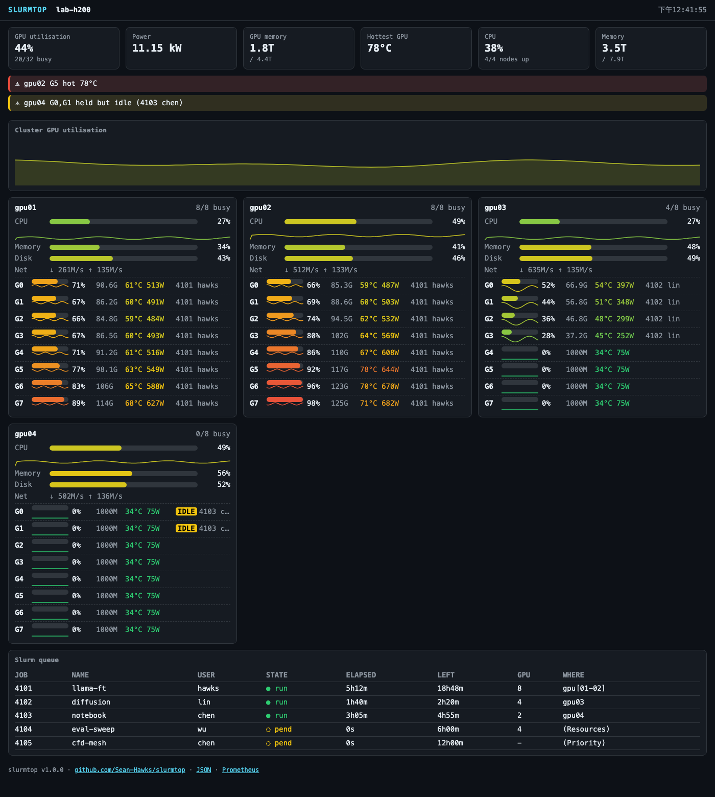
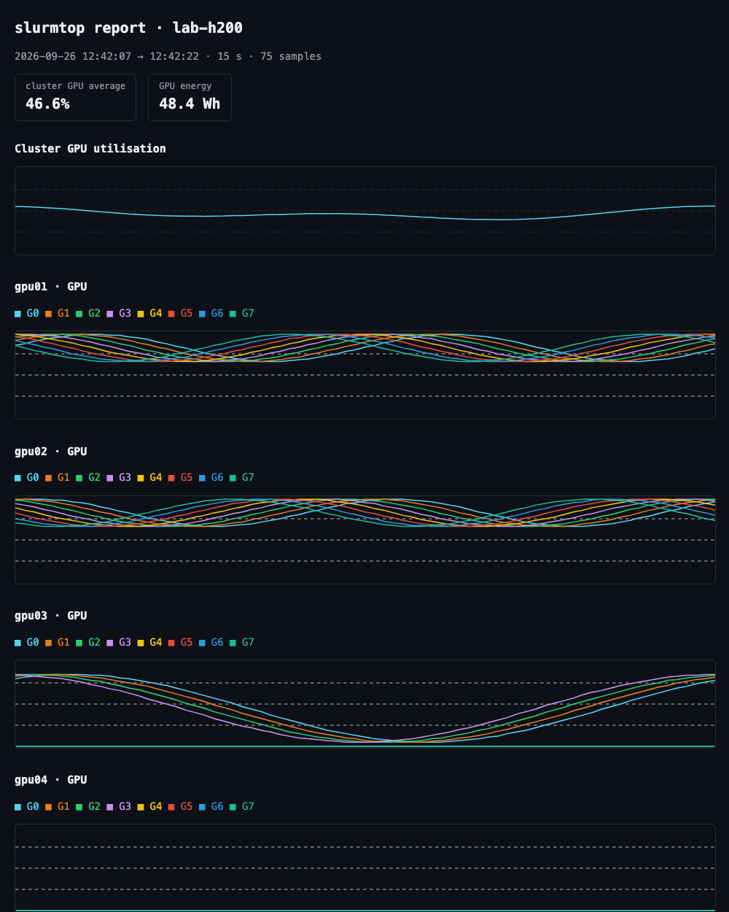

# slurmtop

**實驗室裡每一張 GPU 的狀況，一個檔案就看得到——終端機、瀏覽器、效能報告都行，節點上什麼都不用裝。**

[English](README.md) · [使用手冊](docs/MANUAL.zh-TW.md) · [User manual](docs/MANUAL.md)

`slurmtop` 是一支 Python 腳本（只用標準函式庫、Python 3.8 以上），顯示每台節點的 CPU、記憶體、
磁碟、網路和每一張 GPU 的使用率，告訴你每張卡是誰的 job 佔著，並列出 Slurm 佇列。其他機器用一般的
SSH 讀，所以不需要裝 agent、資料庫或常駐程式。




*上：終端機畫面（用 `--flair` 錄的）。下：`slurmtop --web` 在瀏覽器裡。兩張都是 H200 節點的模擬負載——
程式走的是同一條路，只是資料是合成的，所以畫面可以重現。*

## 為什麼好用

- **一眼回答「GPU 被誰用、有沒有真的在跑」。** 每張卡那一行最後就是佔著它的 job 和使用者；
  job 分到卡卻放著不用時會被標出來——就算卡上一個行程都沒有也抓得到。
- **你在哪裡都能看。** SSH 進去的終端機、瀏覽器分頁、Grafana、JSON、可以寄出去的報告，
  全部來自同一次取樣。
- **什麼都不用部署。** 把一個檔案放到你操作的那台機器上就好；節點只需要 SSH 和 POSIX `sh`，
  不會在上面裝東西或留下常駐程式。
- **出問題會老實說。** 卡住的節點標成「12 秒前的資料」，其他節點照常更新；連不上的節點、
  過熱的卡、快滿的磁碟都集中在頂端一行警示。
- **不只監看，還能評估效能。** `--report` 錄下一段時間或一個程式的完整執行，給你每張卡的
  平均／p95／峰值使用率、記憶體、溫度、功耗和耗電，還能輸出帶圖表的 HTML 報告。

## 快速開始

```bash
curl -fsSL https://raw.githubusercontent.com/Sean-Hawks/slurmtop/main/install.sh | bash

slurmtop                     # Slurm 叢集：節點自動找
slurmtop --nodes localhost   # 只看這台（筆電、工作站）
slurmtop --ssh-config        # ~/.ssh/config 裡的每一台
slurmtop --web               # 同樣的內容用瀏覽器看：http://127.0.0.1:8765
slurmtop --lang zh           # 繁體中文介面（系統語言是中文時會自動切換）
```

Windows（PowerShell）：`irm https://raw.githubusercontent.com/Sean-Hawks/slurmtop/main/install.ps1 | iex`，
再執行 `slurmtop --nodes localhost` 或 `slurmtop --web`。

## 同一份資料，四種看法

| 你想要… | 執行 | 得到 |
|---|---|---|
| 終端機即時畫面 | `slurmtop` | 節點面板、每張卡的長條和歷史、誰佔著、警示、佇列 |
| 用瀏覽器、手機、大螢幕看 | `slurmtop --web` | 自給自足的儀表板（不連 CDN，叢集不能上網也能用） |
| 在 Grafana 畫圖、用 Prometheus 發警報 | `slurmtop --web`，抓 `/metrics` | 節點與每張卡的指標、擁有者、各狀態的 job 數 |
| 評估一次訓練或 benchmark | `slurmtop --report -- python train.py` | 摘要表格，加上 `--html` 圖表和 `--log` CSV |
| 給自己的腳本用 | `slurmtop --json` | 一次取樣的 JSON，原始單位 |



## 支援的機器

| 機器 | CPU・記憶體・磁碟・網路 | GPU | 實測過的環境 |
|---|---|---|---|
| Linux | ✓ | NVIDIA（`nvidia-smi`）、AMD（amdgpu sysfs，不用裝 ROCm 工具）、NVIDIA Jetson | NVIDIA：最早就是為一台 H200 Slurm 叢集寫的（較早的版本）；AMD、Jetson 和最新功能：錄下來的輸出 |
| macOS | ✓ | Apple Silicon 與 Intel Mac 的 GPU（`ioreg`，不用 sudo） | 真的 M3 MacBook |
| Windows 10／11 | ✓ | NVIDIA（`nvidia-smi.exe`） | 真的 Windows 11 電腦＋RTX 4070 Ti SUPER |
| FreeBSD | ✓ | 有裝 `nvidia-smi` 就讀 NVIDIA | 錄下來的輸出 |
| 任何能 SSH 的節點 | 用一段 POSIX `sh` 腳本透過 SSH 讀 | 同上 | bash、dash、ksh、sh；zsh、csh、tcsh 登入都能跑 |

你操作的那台需要 Python 3.8 以上。有 Slurm 就顯示 job 和佇列，沒有 Slurm 其他功能照樣能用。
終端機顯示不了 Unicode 時會自動改成純 ASCII 畫面。

## 常用招式

```bash
slurmtop --me                          # 只看我的 job 和我佔用的卡
slurmtop --dense                       # 機器很多時一台一行（放不下時會自動切換）
slurmtop --once                        # 印一個畫面就結束，方便貼到聊天室
slurmtop --report 600 --html run.html  # 錄十分鐘，留一份 HTML 報告
slurmtop --log usage.csv               # 看的同時把每次取樣存成 CSV
```

在批次 job 裡，包住你想評估的那一步：

```bash
slurmtop --nodes "$(hostname -s)" --report --html "report-$SLURM_JOB_ID.html" -- srun python train.py
```

所有細節都在[使用手冊](docs/MANUAL.zh-TW.md)：每個參數、畫面上每個部分怎麼看、用 SSH 通道或反向代理開放
網頁儀表板、Prometheus 和 Grafana、效能報告、疑難排解。

<details>
<summary>終端機畫面的純文字版</summary>

```
◤ SLURMTOP // lab-h200 ───────────────────────────────────────────────────────────────────────────────────────────────────────────────── 12:43:04 ◥
  ▁▂▄▅▆▇█▁▁▁▁▁▁▁▁    CORE  20/32 online
  46.2% UTIL         PWR    11.57 kW   MEM   1908/4493 GiB   THRM  80°C  ▲ THERMAL
  · ▄▄▄▄▄▄▄▄▄▄▄▄     GRID  ▉▉▉▉▉▉▉▉  │  ▉▉▉▉▉▉▉▉  │  ▉▉▉▉▁▁▁▁  │  ▁▁▁▁▁▁▁▁
  ⚠ gpu02 G5 hot 80°C · gpu04 G0,G1 held but idle (4103 chen)
╭┤ LOAD // last 30 samples ├──────────────────────────────────────────────────────────────────────────────────────────────────────────────────────╮
│ ·····························│················································································································· │
│ ·····························│················································································································· │
│ ▂▂▂▁▁▁  ·····················│················································································································· │
│ ████████▇▇▇▆▆▅▅▅▅▅▄▄▄▄▅▅▅▅▅▅▆▆················································································································· │
│ ██████████████████████████████················································································································· │
│ ██████████████████████████████················································································································· │
╰─────────────────────────────────────────────────────────────────────────────────────────────────────────────────────────────────────────────────╯
╭┤ NODE gpu01 ◉ LOCAL ├ 8/8 busy · 853G · 4.7 kW╮╭┤ NODE gpu02 ◉ SSH ├ 8/8 busy · 932G · 5.1 kW ·╮╭┤ NODE gpu03 ◉ SSH ├ 4/8 busy · 115G · 1.1 kW ·╮
│ CPU ▕██░░░░░░░░░░░░▏  14.8% ▲ load 20 30 28   ││ CPU ▕█████░░░░░░░░░▏  37.3% ▲ load 30 30 28   ││ CPU ▕██░░░░░░░░░░░░▏  14.8% ▲ load 40 30 28   │
│ MEM ▕█████░░░░░░░░░▏  33.9%   684/2015 GiB    ││ MEM ▕██████░░░░░░░░▏  41.2%   830/2015 GiB    ││ MEM ▕███████░░░░░░░▏  48.5%   977/2015 GiB    │
│ DSK  42.9%   NET ↓  582M/s ↑ 56.4M/s          ││ DSK  46.3%   NET ↓  547M/s ↑ 56.5M/s          ││ DSK  49.4%   NET ↓  323M/s ↑ 56.6M/s          │
│ G0 ▕████████░░░░▏  67%   85.6G 59°  488W 4101 ││ G0 ▕█████████░░░▏  78%   99.4G 63°  556W 4101 ││ G0 ▕████░░░░░░░░▏  31%   40.3G 46°  267W 4102 │
│ G1 ▕████████░░░░▏  70%   89.4G 60°  507W 4101 ││ G1 ▕██████████░░▏  84%  107.4G 66°  595W 4101 ││ G1 ▕███░░░░░░░░░▏  24%   31.2G 43°  223W 4102 │
│ G2 ▕█████████░░░▏  75%   95.6G 62°  537W 4101 ││ G2 ▕███████████░▏  90%  115.1G 68°  632W 4101 ││ G2 ▕██░░░░░░░░░░▏  17%   23.2G 41°  183W 4102 │
│ G3 ▕██████████░░▏  81%  103.4G 65°  575W 4101 ││ G3 ▕███████████░▏  95%  121.2G 70°  662W 4101 ││ G3 ▕█░░░░░░░░░░░▏  12%   16.6G 39°  151W 4102 │
│ G4 ▕██████████░░▏  87%  111.4G 67°  614W 4101 ││ G4 ▕████████████▏  97%  124.7G 71°  679W 4101 ││ G4 ▕░░░░░░░░░░░░▏   0%    1.0G 34°   75W      │
│ G5 ▕███████████░▏  93%  118.4G 69°  649W 4101 ││ G5 ▕████████████▏  98%  125.2G 80°  682W 4101 ││ G5 ▕░░░░░░░░░░░░▏   0%    1.0G 34°   75W      │
│ G6 ▕████████████▏  96%  123.3G 71°  673W 4101 ││ G6 ▕████████████▏  96%  122.4G 70°  668W 4101 ││ G6 ▕░░░░░░░░░░░░▏   0%    1.0G 34°   75W      │
│ G7 ▕████████████▏  98%  125.4G 71°  682W 4101 ││ G7 ▕███████████░▏  91%  117.0G 69°  641W 4101 ││ G7 ▕░░░░░░░░░░░░▏   0%    1.0G 34°   75W      │
╰───────────────────────────────────────────────╯╰───────────────────────────────────────────────╯╰───────────────────────────────────────────────╯
╭┤ NODE gpu04 ◉ SSH ├ 0/8 busy · 8G · 0.6 kW · 3╮
│ CPU ▕█████░░░░░░░░░▏  37.3% ▲ load 50 30 28   │
│ MEM ▕████████░░░░░░▏  55.7%   1123/2015 GiB   │
│ DSK  52.1%   NET ↓  116M/s ↑ 56.6M/s          │
│ G0 ▕░░░░░░░░░░░░▏   0%    1.0G 34°   75W IDLE │
│ G1 ▕░░░░░░░░░░░░▏   0%    1.0G 34°   75W IDLE │
│ G2 ▕░░░░░░░░░░░░▏   0%    1.0G 34°   75W      │
│ G3 ▕░░░░░░░░░░░░▏   0%    1.0G 34°   75W      │
│ G4 ▕░░░░░░░░░░░░▏   0%    1.0G 34°   75W      │
│ G5 ▕░░░░░░░░░░░░▏   0%    1.0G 34°   75W      │
│ G6 ▕░░░░░░░░░░░░▏   0%    1.0G 34°   75W      │
│ G7 ▕░░░░░░░░░░░░▏   0%    1.0G 34°   75W      │
╰───────────────────────────────────────────────╯
╭┤ Slurm queue ├──────────────────────────────────────────────────────────────────────────────────────────────────────────────────────────────────╮
│     JOB NAME      USER   STATE  ELAPSED PROG  LEFT   GPU WHERE              JOB NAME      USER   STATE  ELAPSED PROG  LEFT   GPU WHERE          │
│    4101 llama-ft  hawks  ● run  5h12m   █░░░░ 18h48m  8 gpu[01-02]         4102 diffusion lin    ● run  1h40m   ██░░░ 2h20m   4 gpu03           │
│    4103 notebook  chen   ● run  3h05m   ██░░░ 4h55m   2 gpu04              4104 eval-swee wu     ◌ pend 0s      ░░░░░ 6h00m   4 (Resources)     │
│    4105 cfd-mesh  chen   ◌ pend 0s      ░░░░░ 12h00m  - (Priority)                                                                              │
│ ┈┈┈┈┈┈┈┈┈┈┈┈┈┈┈┈┈┈┈┈┈┈┈┈┈┈┈┈┈┈┈┈┈┈┈┈┈┈┈┈┈┈┈┈┈┈┈┈┈┈┈┈┈┈┈┈┈┈┈┈┈┈┈┈┈┈┈┈┈┈┈┈┈┈┈┈┈┈┈┈┈┈┈┈┈┈┈┈┈┈┈┈┈┈┈┈┈┈┈┈┈┈┈┈┈┈┈┈┈┈┈┈┈┈┈┈┈┈┈┈┈┈┈┈┈┈┈┈┈┈┈┈┈┈┈┈┈┈┈┈┈┈┈ │
│  gpu01      mixed    CPU ▕███████░░░▏ 160/224 idle 64   RAM free 725 GiB                                                                        │
│  gpu02      mixed    CPU ▕███████░░░▏ 160/224 idle 64   RAM free 725 GiB                                                                        │
│  gpu03      mixed    CPU ▕███████░░░▏ 160/224 idle 64   RAM free 725 GiB                                                                        │
│  gpu04      mixed    CPU ▕███████░░░▏ 160/224 idle 64   RAM free 725 GiB                                                                        │
╰─────────────────────────────────────────────────────────────────────────────────────────────────────────────────────────────────────────────────╯
  Ctrl-C quit  ·  --proc processes  ·  --stack vertical  ·  -n <sec> interval                                                team-03/Hawks · v1.1.0
```

</details>

## 跟其他工具比

- **`nvtop`／`nvitop`** 把一台機器看得很細。slurmtop 同時看很多台、認得 Slurm 的 job，
  還多了瀏覽器、Prometheus 和報告。
- **DCGM exporter＋Prometheus＋Grafana** 適合大型、長期的正式架設。slurmtop 是你**今天**就能在幾台
  節點上跑起來、什麼都不用裝的工具——之後也可以餵給那套 Grafana。
- **`squeue`** 告訴你排了什麼；slurmtop 還告訴你分出去的 GPU 到底有沒有在做事。

## 安全

- 只讀不寫：`nvidia-smi`、`/proc`、`/sys`、`df`、`netstat`、`squeue`、`sinfo`、`scontrol`，節點上什麼都不寫。
- job 名稱和使用者名稱是別人取的：會先去掉終端機控制字元，網頁上也一律當純文字顯示。
- `--web` 預設只聽 `127.0.0.1`、沒有登入機制。請用 SSH 通道連過來，或放在會驗證身分的反向代理後面——見使用手冊。

## 作者

由 **team-03 / Hawks** 在國網中心 [HiPAC 2026](https://www.nchc.org.tw/) 期間開發——
因為每台節點開一個 tmux 視窗跑 `watch nvidia-smi` 實在太累了。歡迎開 issue 和 pull request。


## 授權

MIT
